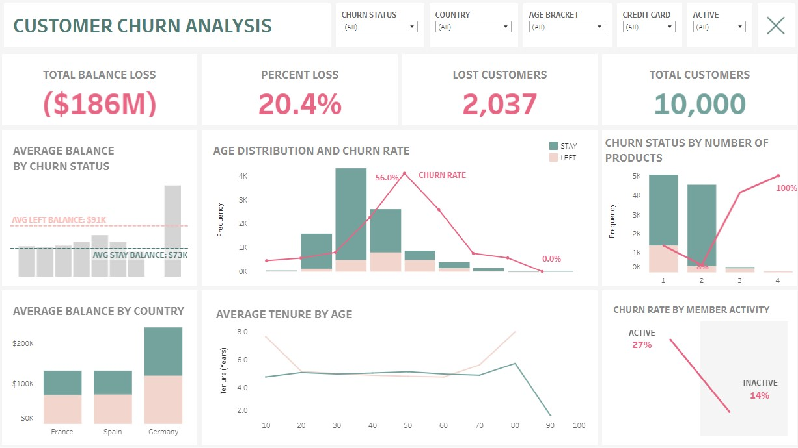

# 
 UK Bank Customer Churn Prediction

 
  

  
 
  <a href="https://github.com](https://unsplash.com/photos/gray-concrete-building-during-daytime-WgUHuGSWPVM">Photo by Ferran Fusalba Roselló on Unsplash</a>

## PROBLEM STATEMENT
Banks face a significant challenge in retaining customers, as customer churn can lead to substantial financial losses and hinder business growth. Identifying customers at risk of churning is crucial for banks to implement proactive retention strategies and maintain customer loyalty. Churn can result in lost revenue, increased acquisition costs, damaged reputation, reduced market share, and operational inefficiencies.

## OBJECTIVE
Investigate data to discover patterns and develop a robust machine learning model capable of accurately predicting customer churn. This model will serve as a valuable tool for marketing analysts to identify at-risk customers, enabling them to design targeted retention campaigns and optimize marketing budgets for maximum impact.

## METHODOLOGY

### Data Source
This customer churn dataset from [Kaggle](https://www.kaggle.com/datasets/mathchi/churn-for-bank-customers) contains information for 10K bank customers with 14 features describing their demographics, account details, banking activity and churn status, making it directly relevant for predicting customer churn.

There are two main types of features: numeric and categorical
- 7 numeric features: RowNumber, CustomerId ,CreditScore, Age, Tenure, Balance, EstimatedSalary
- 7 categorical features: Surname, Gender, Geography, NumOfProducts, HasCrCard, IsActiveMember, Exited

### Exploratory Data Analysis

Data cleaning and exploratory data analysis can be viewed in this [notebook](/notebooks/1.0_bank_exploratory_data_analysis.ipynb)

Seee visualizations from the exploratory data analysis [here](https://public.tableau.com/views/Customer_Churn_Dashboard_17296929312660/DASHBOARD?:language=en-US&publish=yes&:sid=&:redirect=auth&:display_count=n&:origin=viz_share_link)

### Modeling Techniques
The objective is to build a model that predict whether a customer is likely to churn by training various classification models, including decision tree, random forest, and xgboost, on the training data. The model with the best performance will be chosen as the winner. This winning model will then be used to predict churn on new, unseen data.

Check out this [notebook](notebooks/2.0_bank_model_training_and_evaluation.ipynb) for the modeling training and evaluation training.

### Evaluation Metric
In predicting customer churn, the model can make two types of mistakes:

- **False positive**: The model predicts a customer will leave (churn) but they stay. This might lead to unnecessary efforts to retain the customer.
- **False negative**: The model predicts a customer will stay but they end up leaving. This can be more costly, as the bank misses the chance to intervene.
  
Since it's more critical to avoid missing churned customers, focusing on recall (catching churners) seems ideal. However, prioritizing recall alone could lead the model to mistakenly predict churn for many customers who wouldn't actually leave. This would result in the bank wasting resources on unnecessary customer retention efforts.

To strike a balance, the **F1 score** is a better metric to use. It considers both recall and precision (correctly identifying non-churners), giving a more accurate picture of the model's performance. 

## RESULTS AND INSIGHTS

### Model Results: 

The F1 scores from all models are ranked in descending order and the the XGBoost score on the test data ranks the highest at 0.77, indicating a strong balance between precision and recall. Compared to the F1 scores of 0.56 and 0.61, this is a significant improvement. It suggests that tuning the decision tree and exploring other algorithms/features, have been effective.

Check out this [notebook](notebooks/2.0_bank_model_training_and_evaluation.ipynb) for the modeling training and evaluation training.
###  Key Insights: 

Of 10,000 bank customers, 2037 customers left leading to total of $185M loss in balance. Key insights were discovered from the following features.
- **Balance**: 30% of customers have a balance of zero in their account. Those who churned had significantly higher average balances ($91K) compared to those who stayed ($72K)
- **Age**: 60% ($111M) are from customers between 40-60 age bracket, which averages a churn rate of 40%
- **Geography**: Customers who left in Germany had significantly higher average balances ($120,000) compared to France ($71,000) and Spain ($73,000). Germany also has the highest churn rate (32%), suggesting that a higher proportion of customers with larger balances are leaving the company in Germany, potentially impacting revenue.
- **Tenure**: Customers under 70 are more likely to churn within the first five years of service.
- **Number of Products**: Customers with a single product have the highest churn rate (50.84%), while those with two products have the lowest churn rate (45.9%). Almost all customers with 3 or more products have churned. 
- **Active Members**: Inactive customers have a significantly higher churn rate (26.9%) compared to active customers (14.3%). 

View Interactive dashboard for more details [here](https://public.tableau.com/views/Customer_Churn_Dashboard_17296929312660/DASHBOARD?:language=en-US&publish=yes&:sid=&:redirect=auth&:display_count=n&:origin=viz_share_link)

# RECOMMENDATIONS

### For Marketing Analyst
From the data analysis, Germany is losing a higher proportion of customers with larger balances. Further investigation into the reasons behind churn in Germany might be beneficial to mitigate customer losses and the associated revenue impact.

A quarter of lost customers had no account balance, suggesting they might not have been actively using our services. The bank can explore following actions. 
- Bundled Packages: Offer discounted package deals to encourage customers to explore multiple products.
- Re-engagement Campaigns: Reach out to inactive customers with personalized incentives to reactivate their accounts.
- Understand Inactivity: Conduct surveys to identify reasons for account inactivity and address underlying issues.
- Personalized Onboarding: Tailor onboarding experiences for Millennials, offering financial literacy resources and goal-setting tools.
- Target High-Value Customers: Prioritize retention efforts for customers with significant balances, especially in Germany.
- Enhance Customer Experience: Invest in digital channels, improve customer support, and collect feedback.
- Promote Product Bundling: Encourage customers to adopt multiple products to increase their value to the bank.
- Geographic Segmentation: Develop tailored strategies for different regions, especially Germany.

### For Model Improvements
The model was built using most features. To potentially improve its F1 score, we can try simplifying it by removing less important features. We can also explore creating new features from the existing ones, like combining income and age into a financial maturity score. Focusing on the most important features, like income, credit score, account balance, and age, might reveal additional insights to enhance the model's performance.

# Technologies Used

- Programming languages: Python 
- Libraries and frameworks: Pandas, Numpy, Matplotlib, Seaborn, Scikit-Learn 
- Cloud platforms: 

# Project Structure

### Directory
  - [data](https://github.com/aprilhong/bankchurn/tree/main/data) : folder containing all data files
    - **churn_data.csv**: raw dataset from [Kaggle](https://www.kaggle.com/datasets/mathchi/churn-for-bank-customers)
    - **df_cleaned**: file saved from eda notebook.
  - [models](https://github.com/aprilhong/bankchurn/tree/main/models) : folder containing all model files
    - **tree_cv_model.pickle, rf_cv_model.pickle**, **xgb_cv_model.pickle** 
    - **model_results_table.csv** : summary table of scoring metrics from all models
    - **xgb_decision_tree.png** : decision tree output from xgb prediction on test data.
  - [notebooks](/notebooks)
    - [1.0_bank_exploratory_data_analysis.ipynb](notebooks/1.0_bank_exploratory_data_analysis.ipynb)
    - [2.0_bank_model_training_and_evaluation.ipynb](notebooks/2.0_bank_model_training_and_evaluation.ipynb)
  - [bankchurn.ipynb](https://github.com/aprilhong/bankchurn/blob/main/bankchurn.ipynb) - notebook will full analysis
  - [requirements.txt](https://github.com/aprilhong/bankchurn/blob/main/requirements.txt) : set up to install all listed packages in the development environment
  - [results_table.py](https://github.com/aprilhong/bankchurn/blob/main/results_table.py) : module to create a table from model's evaluation metrics.

